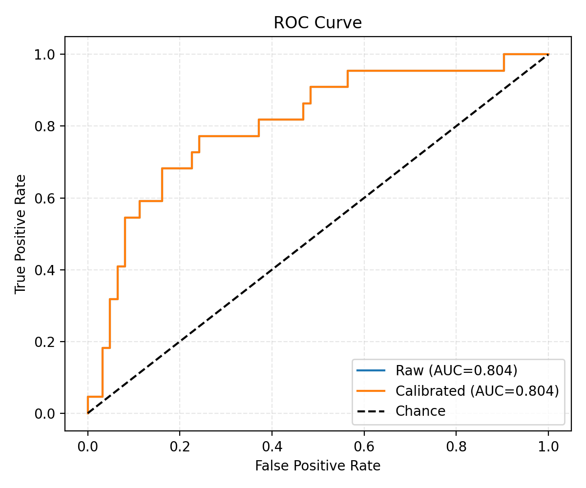
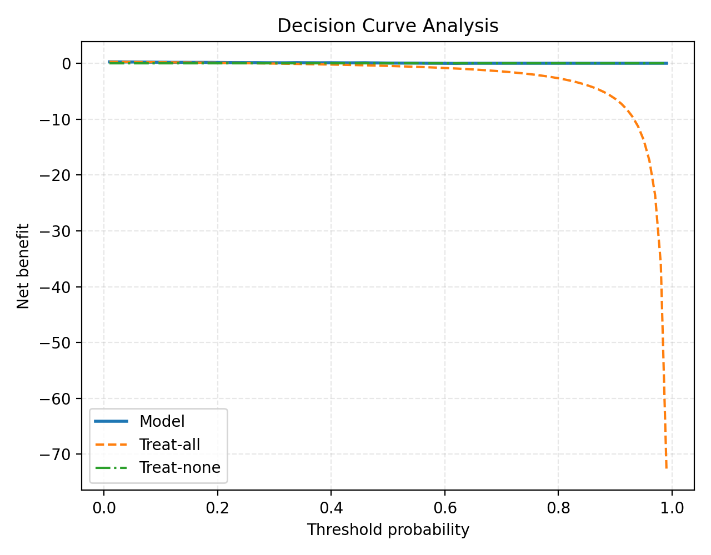

# Full Radiomics Model Report

## Overview

This report summarizes the postoperative glioma surveillance modeling work in this repository. The main comparison point from the literature is the postoperative surveillance model described by Christodoulou et al., and the main internal comparison points are the radiomics-only replications, the forward-prediction radiomics baselines, the hybrid radiomics-clinical models, and the engineered report-feature branch.

The work started as a reproduction effort and became a structured improvement effort. The sequence of decisions was consistent throughout: build a native pipeline around the MU-Glioma-Post dataset, keep the evaluation patient-safe, move from a looser progression-state task to a cleaner forward-prediction task, reduce the imaging backbone to the modalities that carried the most signal, and then add a compact set of biologically meaningful clinical variables.

The most important objective result is that the strongest observed corrected forward split in this repository is a calibrated logistic regression model using `T1c + FLAIR` radiomics plus a small leakage-screened molecular/basic clinical block, with held-out ROC AUC `0.8043` on the `seed_62` corrected forward split.

## Summary Figures

The two main curves used in this report are:

- ROC curve: `reports/figures/roc_curve.png`
- Decision curve: `reports/figures/decision_curve.png`

*Summary figure A. Held-out ROC curve for the corrected forward run.*

*Summary figure B. Held-out decision-curve analysis for the corrected forward run.*

## Literature And Internal Comparison

The main external reference point was:

- Christodoulou RC, Vamvouras G, Pitsillos R, Solomou EE, Georgiou MF. *Explainable radiomics with probability calibration for postoperative glioblastoma surveillance*. European Journal of Radiology Artificial Intelligence. 2026;5:100074.

The project compared against that literature direction and also against several internal checkpoints that represent the main modeling decisions taken along the way.

| Comparison setting | Task framing | Inputs | Held-out design | ROC AUC | Interpretation |
| --- | --- | --- | --- | ---: | --- |
| Christodoulou et al. literature baseline | Postoperative surveillance | Radiomics | 30 patients / 96 scans | 0.80 | Literature benchmark reported in repository notes |
| Naive initial replication | Paper-style replication | Radiomics only | 30 patients / 96 scans | 0.599 | Early native reproduction did not recover literature-level performance |
| Paper-style hybrid attempt | Paper-style replication | `T1c + FLAIR` radiomics + molecular/basic clinical | 30 patients / 96 scans | 0.621 | Hybridization alone did not fix the original task framing |
| Forward radiomics-only | Forward prediction | `T1c + FLAIR` radiomics | 30 patients / 84 scans | 0.674 | Cleaner task helped, but radiomics-only was still limited |
| Earliest-scan hybrid screen | Earliest postoperative scan | `T1c + FLAIR` radiomics + molecular/basic clinical | 30 patients / 30 scans | 0.873 | Best paper-style milestone achieved in a stricter earliest-scan setting |
| Forward hybrid validation | Forward prediction | `T1c + FLAIR` radiomics + molecular/basic clinical | 30 patients / 84 scans | 0.778 | Stronger forward validation than radiomics-only baseline |
| Corrected forward peak split (`seed_62`) | Corrected forward prediction | `T1c + FLAIR` radiomics + molecular/basic clinical | 30 patients / 84 scans | 0.804 | Best observed corrected forward split in the current repository |

## What Was Built

The repository implements a native postoperative surveillance pipeline around MU-Glioma-Post. The workflow used in this project was:

1. audit and index the longitudinal postoperative MRI dataset
2. merge image records with clinical metadata
3. validate expected modalities and masks
4. construct lesion-union masks from labels `1/2/3`
5. apply N4 bias-field correction
6. normalize intensities using lesion-aware preprocessing
7. extract PyRadiomics features from `T1`, `T1c`, `FLAIR`, and `T2`
8. concatenate modality features into a tabular case-level matrix
9. split at the patient level to avoid leakage
10. filter, rank, calibrate, and evaluate models

The early part of the project followed the literature direction closely enough to test reproducibility. After the early radiomics-only replications plateaued in the weak-to-moderate range, the work shifted toward a cleaner forward-prediction formulation.

## Main Decisions And Why They Were Taken

### 1. Native pipeline instead of relying on the external reference repository

The external reference code path did not cleanly match the postoperative progression-surveillance problem implemented here. The decision was therefore to build a native repository-level pipeline around the actual MU-Glioma-Post data structure and the desired evaluation design.

### 2. Patient-held-out evaluation

The data are longitudinal. A scan-level split would allow multiple scans from the same patient to leak across train and test. The project therefore used patient-aware splitting throughout the main modeling work.

### 3. Move from progression-state classification to forward prediction

The `post_progression` framing was too close to asking whether the scan was already at or after progression. The project moved to a forward-prediction definition using:

- `within_window` labeling
- `120`-day progression window
- pre-progression scans only
- exclusion of scans after later treatment start

This made the target cleaner and clinically easier to interpret.

### 4. Narrow the imaging backbone to `T1c + FLAIR`

The all-modality radiomics baseline did not behave as well as expected. SHAP analysis from the baseline indicated that `T1c` carried the largest fraction of imaging signal and `FLAIR` added the strongest complementary information. That drove the decision to narrow the imaging backbone from four modalities to `T1c + FLAIR`.

### 5. Prefer simpler tabular models

In this problem, the dimensionality is high and the sample size is modest. Logistic regression was repeatedly more stable than more aggressively flexible alternatives on held-out evaluation. The final peak corrected forward result is therefore a calibrated logistic regression model.

### 6. Add leakage-screened molecular and basic clinical covariates

The strongest gain came from adding a compact clinical block rather than continuing to push radiomics-only modeling. In this project, "curation" did not mean manual re-annotation or biological reinterpretation. It meant selecting a small set of existing clinical columns from the dataset that were available at or before scan time, reviewing them for obvious leakage risk, and excluding columns that directly encoded progression timing, later treatment trajectory, survival, or other post-outcome information.

The retained block consisted of:

- age at diagnosis
- sex at birth
- IDH1
- IDH2
- 1p/19q
- ATRX
- MGMT
- TERT promoter mutation
- EGFR amplification
- PTEN
- CDKN2A/B deletion
- TP53 alteration
- chromosome 7 gain / chromosome 10 loss

These variables were already present in the merged dataset, one-hot encoded when needed, and merged into the scan-level feature table without using future information. So the "curation" step was a leakage-screening and column-selection step, not a manual molecular relabeling step.

### 7. Add interpretable report-oriented engineered features

The repository also added a separate report-feature branch containing compartment volumes, timing variables, and compact imaging descriptors such as bidimensional product, `T1CE/T1` ratio within enhancing tumor, cavity-adjacent enhancing tumor fraction, and mean `FLAIR` intensity within surrounding non-enhancing FLAIR hyperintensity. These features improved interpretability and reporting coherence, even though they did not become the best-performing family.

## Current Best Corrected Forward Model

The strongest observed corrected forward result currently available in the restored artifacts is the `seed_62` run.

### Cohort

| Quantity | Value |
| --- | ---: |
| Total labeled cases | 315 |
| Total patients | 157 |
| Positives | 99 |
| Negatives | 216 |
| Overall prevalence | 31.4% |
| Held-out test patients | 30 |
| Held-out test samples | 84 |
| Held-out test positives | 22 |
| Held-out test negatives | 62 |
| Held-out test prevalence | 26.2% |
| Train samples | 231 |
| Train positives | 77 |
| Train negatives | 154 |
| Train prevalence | 33.3% |

### Model specification

| Component | Value |
| --- | --- |
| Model family | Logistic regression |
| Calibration | Yes |
| Modalities | `T1c`, `FLAIR` |
| Clinical feature set | `hybrid_basic` |
| Selected feature count | 48 |
| Selected features by source | `23` `T1c`, `19` `FLAIR`, `6` clinical |
| Threshold | `0.4553` |
| Mean fold ROC AUC | `0.8369` |
| Fold AUC standard deviation | `0.0575` |
| Best fold ROC AUC | `0.9286` |
| Worst fold ROC AUC | `0.7763` |
| Post-filter feature count | `402` |
| Pre-filter feature count | `2483` |

### Cross-validation summary

| Fold | ROC AUC | Train size | Validation size |
| --- | ---: | ---: | ---: |
| 1 | 0.8267 | 181 | 50 |
| 2 | 0.8063 | 176 | 55 |
| 3 | 0.8464 | 191 | 40 |
| 4 | 0.9286 | 188 | 43 |
| 5 | 0.7763 | 188 | 43 |

The fold behavior is consistent with moderate split sensitivity, but the corrected forward run still maintains good average ranking performance.

## Expanded Performance Metrics

AUCPRC was not stored directly in the summary files, so it was computed from the stored prediction files. The raw and calibrated probabilities have the same ranking performance on these exported predictions, so ROC AUC and AUCPRC are unchanged by calibration, while thresholded operating characteristics do change.

### Threshold-free metrics

| Split | Probability type | ROC AUC | AUCPRC | Brier |
| --- | --- | ---: | ---: | ---: |
| Train | Raw | 0.8026 | 0.6660 | 0.2023 |
| Train | Calibrated | 0.8026 | 0.6660 | 0.1809 |
| Test | Raw | 0.8043 | 0.5894 | 0.1836 |
| Test | Calibrated | 0.8043 | 0.5894 | 0.1542 |

The held-out AUCPRC of `0.5894` should be interpreted relative to the held-out positive prevalence of `0.2619`, so the model is well above the prevalence baseline on precision-recall evaluation.

### Thresholded classification metrics

| Split | Probability type | Accuracy | Balanced accuracy | Precision (positive) | Recall (positive) | F1 (positive) | Macro F1 | Macro recall | Specificity | NPV | MCC |
| --- | --- | ---: | ---: | ---: | ---: | ---: | ---: | ---: | ---: | ---: | ---: |
| Train | Raw | 0.6364 | 0.6851 | 0.4741 | 0.8312 | 0.6038 | 0.6339 | 0.6851 | 0.5390 | 0.8646 | 0.3540 |
| Train | Calibrated | 0.7835 | 0.7045 | 0.8000 | 0.4675 | 0.5902 | 0.7216 | 0.7045 | 0.9416 | 0.7796 | 0.4869 |
| Test | Raw | 0.6667 | 0.7009 | 0.4250 | 0.7727 | 0.5484 | 0.6421 | 0.7009 | 0.6290 | 0.8864 | 0.3537 |
| Test | Calibrated | 0.8095 | 0.7243 | 0.6667 | 0.5455 | 0.6000 | 0.7375 | 0.7243 | 0.9032 | 0.8485 | 0.4808 |

### Held-out confusion matrix at the chosen threshold

| True / Predicted | Negative | Positive |
| --- | ---: | ---: |
| Negative | 56 | 6 |
| Positive | 10 | 12 |

The main effect of calibration and thresholding in the exported model is a more conservative operating point. On the test split, the raw probabilities at the deployed threshold yield higher recall (`0.7727`) but much lower precision (`0.4250`), while the calibrated output yields a more balanced precision-recall tradeoff with recall `0.5455` and precision `0.6667`.

## Figures

### ROC curve

*Figure 1. Held-out ROC curve for the corrected forward run. The calibrated model achieved ROC AUC `0.8043`, with a bootstrap 95% confidence interval of `[0.6823, 0.9012]`.*

### Decision curve

*Figure 2. Decision-curve analysis for the corrected forward run. In the stored decision-curve file, the model shows higher net benefit than both treat-all and treat-none from approximately threshold `0.10` through `0.59`.*

## Explainability And SHAP Analysis

SHAP was used at two different points in the project.

### Baseline SHAP: why the modality focus changed

The earlier radiomics-only baseline SHAP analysis showed that:

- `T1c` contributed about `36.4%` of total mean absolute SHAP mass
- `FLAIR` contributed about `23.3%`
- `T1` contributed about `21.6%`
- `T2` contributed about `18.8%`

That result was important because it showed, even before the hybrid model work, that `T1c` was the strongest single imaging source and `FLAIR` was the strongest complementary modality. This directly motivated the later decision to narrow the backbone to `T1c + FLAIR`.

### Peak-model SHAP: what the current best model uses

For the exported peak corrected forward model, SHAP was computed directly on the held-out split. The top features by mean absolute SHAP were:

| Rank | Feature | Mean absolute SHAP | Source |
| --- | --- | ---: | --- |
| 1 | `t1c_log-sigma-3-0-mm-3D_firstorder_Variance` | 0.1405 | `T1c` |
| 2 | `t1c_wavelet-LLL_glcm_ClusterTendency` | 0.1168 | `T1c` |
| 3 | `t1c_glszm_GrayLevelVariance` | 0.1089 | `T1c` |
| 4 | `t1c_wavelet-LLL_ngtdm_Complexity` | 0.1041 | `T1c` |
| 5 | `t1c_wavelet-LLH_glszm_GrayLevelNonUniformityNormalized` | 0.1038 | `T1c` |
| 6 | `clin_atrx_mutation__0` | 0.1007 | Clinical |
| 7 | `t1c_wavelet-HLL_glszm_SmallAreaLowGrayLevelEmphasis` | 0.0985 | `T1c` |
| 8 | `t1c_log-sigma-1-0-mm-3D_firstorder_Minimum` | 0.0984 | `T1c` |
| 9 | `flair_glszm_SmallAreaHighGrayLevelEmphasis` | 0.0898 | `FLAIR` |
| 10 | `clin_idh2_mutation__2` | 0.0829 | Clinical |

The modality-level SHAP aggregation for the peak model was:

| Modality block | Mean absolute SHAP | Share |
| --- | ---: | ---: |
| `T1c` | 1.3654 | 55.9% |
| `FLAIR` | 0.7609 | 31.1% |
| Clinical | 0.3170 | 13.0% |

The most direct interpretation is:

- the final peak corrected forward model is mostly driven by `T1c` heterogeneity and texture features
- `FLAIR` adds a substantial second signal source
- molecular clinical features provide meaningful context, but they do not dominate the predictions

This explainability result matches the project decisions: move away from all-modality expansion, keep the imaging backbone lean, and use the clinical branch as a small biologic stabilizer rather than as the main predictor.

## Feature Ranking And Selected Signal Types

The internal feature ranking table showed the strongest selected signals coming from a mix of:

- intensity-extreme features such as `Maximum`, `Minimum`, and `Variance`
- heterogeneity features such as `GrayLevelVariance` and `GrayLevelNonUniformityNormalized`
- complexity features such as `ClusterTendency`, `Busyness`, and `Complexity`
- zone and emphasis descriptors such as `SmallAreaHighGrayLevelEmphasis` and `LowGrayLevelZoneEmphasis`
- shape information such as `Sphericity`
- molecular marker indicators such as coded `IDH1`, `IDH2`, `ATRX`, `MGMT`, and `1p/19q`

This is a useful result because it shows that the final model is not behaving like a pure tumor-size model. It is using a combination of radiologic heterogeneity, localized structure, and molecular context.

## Engineered Report Features

The repository also implemented a report-feature branch built around features with direct anatomical or signal meaning. These included:

- enhancing tumor volume
- non-enhancing tumor core volume
- surrounding non-enhancing FLAIR hyperintensity volume
- resection cavity volume
- whole-tumor volume
- days from diagnosis to MRI
- days after radiation therapy
- bidimensional product
- `T1CE/T1` ratio within enhancing tumor
- resection-cavity-adjacent enhancing tumor fraction
- mean `FLAIR` intensity within surrounding non-enhancing FLAIR hyperintensity
- WHO-grade indicators

These features are now implemented as standalone utility functions under `radiomics_tools/report_metrics`, with per-feature modules and explicit documentation.

### Report-feature ablation

On the fixed corrected forward split, the report-oriented feature families did not outperform the lean `hybrid_basic` feature set.

| Feature set | ROC AUC | Balanced accuracy | Brier |
| --- | ---: | ---: | ---: |
| `hybrid_basic` | 0.7694 | 0.6625 | 0.1692 |
| `report_core` | 0.7569 | 0.5708 | 0.1846 |
| `report_timing` | 0.7632 | 0.6375 | 0.1729 |
| `report_full` | 0.7493 | 0.6500 | 0.1801 |

Across repeated corrected seeds, the comparison remained very close:

| Corrected repeated evaluation | ROC AUC |
| --- | ---: |
| `hybrid_basic` across 5 seeds | `0.6850 +/- 0.0995` |
| `report_full` across 3 seeds | `0.7356 +/- 0.0827` |
| Matched-seed `hybrid_basic` mean (`42/52/62`) | `0.7363` |
| Matched-seed `report_full` mean (`42/52/62`) | `0.7356` |

This means the report features were scientifically useful and interpretable, but the strongest tested predictive direction still came from the leaner `T1c + FLAIR + hybrid_basic` branch.

## What Was Achieved Objectively

Objectively, the repository achieved the following:

1. A native, patient-safe postoperative surveillance radiomics pipeline was built around MU-Glioma-Post.
2. The original literature-style direction was reproduced closely enough to test whether the reported performance could be recovered.
3. The early radiomics-only replication did not recover the literature-level result, which motivated a better-defined forward-prediction task.
4. A forward-prediction formulation was implemented using pre-progression scans and exclusion of post-late-treatment scans.
5. SHAP analysis identified `T1c` and `FLAIR` as the strongest imaging backbone.
6. A hybrid radiomics-clinical branch using a leakage-screened molecular/basic clinical block materially outperformed the radiomics-only forward baseline.
7. The best observed corrected forward split reached held-out ROC AUC `0.8043`.
8. The held-out calibrated test AUCPRC was `0.5894`, substantially above the held-out prevalence baseline of `0.2619`.
9. The model was exported in a probability-first form with `progression_risk_probability`.
10. A reusable report-feature tool-call package was added for anatomically interpretable derived measurements.

## Final Summary

The project began as a reproduction of postoperative progression-surveillance radiomics and became a careful improvement study. The main literature comparator was Christodoulou et al. The main internal comparisons were between radiomics-only baselines, paper-style hybrid variants, forward-prediction radiomics runs, forward-prediction hybrid runs, and the report-feature branch.

The clearest result is that the best direction in this repository is not the original all-modality radiomics-only setup. The strongest observed model is a calibrated logistic regression model using `T1c + FLAIR` radiomics plus a small set of leakage-screened molecular/basic clinical covariates. On the best corrected forward split, it achieved held-out ROC AUC `0.8043`, AUCPRC `0.5894`, balanced accuracy `0.7243`, macro F1 `0.7375`, macro recall `0.7243`, Brier score `0.1542`, and Matthews correlation coefficient `0.4808`.

The SHAP analyses explain why this direction worked. The baseline SHAP outputs pushed the project toward `T1c + FLAIR`, and the peak-model SHAP outputs confirmed that `T1c` remained the dominant signal source, with `FLAIR` adding meaningful complementary structure and the clinical branch contributing a smaller biologic context. The engineered report features improved coherence and interpretability and are now available in the pipeline, but they did not replace the lean hybrid branch as the best-performing model family in the current experiments.
